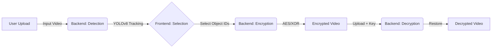

# SecureFrame


Intelligent Object Detection & Selective Video Encryption


## Overview

**SecureFrame** is an advanced privacy protection tool that leverages computer vision to automatically detect objects in video footage and allows users to selectively encrypt specific entities. 

🥇 **1st Place in Cybersecurity at the Toronto Tech Expo**, SecureFrame addresses the growing need for privacy in video data by combining the power of **YOLOv8** for object tracking with robust **AES** encryption standards. Whether for redaction, security, or privacy compliance, SecureFrame ensures that sensitive visual information is protected.

## Key Features

*   **Granular & Reversible Privacy:** SecureFrame offers unique selective encryption, allowing specific, AI-detected objects within a video to be reversibly protected. This enables secure video distribution where sensitive data can be unlocked by authorized personnel.
*   **Novel Codec-Level Security:** Our innovative approach directly manipulates video codec data at the frame level to apply robust, reversible encryption. This method significantly advances beyond traditional redaction or blurring techniques.
*   **AI-Powered Precision:** Leveraging **YOLOv8**, the system autonomously identifies and tracks dynamic objects, enabling users to *manually select and target* specific moving entities (e.g., encrypt all detected persons or vehicles) for precise security application.
*   **Intuitive Control:** A user-friendly interface simplifies the complex process of AI detection and cryptographic selection, making advanced video privacy accessible.

---

## Architecture

The SecureFrame workflow operates in four distinct stages:



1.  **Detect:** The backend processes the uploaded video, tracking objects frame-by-frame.
2.  **Select:** Users view unique object IDs in the UI and choose which ones to secure.
3.  **Encrypt:** Selected regions are encrypted, and metadata is generated.
4.  **Decrypt:** Authorized users can reverse the process to view the original content.

---

## Tech Stack

| Category            | Technologies                               |
| :------------------ | :----------------------------------------- |
| **Object Detection**| Ultralytics YOLOv8, PyTorch                |
| **Computer Vision** | OpenCV                                     |
| **Cryptography**    | PyCryptodome (AES & XOR)                   |
| **Backend**         | Python, Flask                              |
| **Frontend**        | React, Vite                                |

---

## API Reference

The Flask backend exposes the following endpoints:

| Endpoint | Method | Description |
| :--- | :--- | :--- |
| `/detect` | `POST` | Upload video and run YOLOv8 detection. |
| `/encrypt` | `POST` | Encrypt selected object IDs in the processed video. |
| `/decrypt` | `POST` | Decrypt a video using a provided key/nonce. |
| `/ids/encrypt` | `GET` | Get list of unique tracked IDs from detection. |
| `/ids/decrypt` | `GET` | Get list of encrypted IDs from metadata. |
| `/method` | `GET` | Retrieve the encryption method used for the current video. |

---

## Installation

### Prerequisites
*   **Python 3.11+**
*   **Node.js** and **npm**

### Backend Setup

1.  **Clone the repository:**
    ```bash
    git clone https://github.com/yourusername/SecureFrame.git
    cd SecureFrame
    ```

2.  **Create a virtual environment:**
    ```bash
    python -m venv venv
    
    # Windows
    venv\Scripts\activate
    
    # macOS/Linux
    source venv/bin/activate
    ```

3.  **Install Python dependencies:**
    ```bash
    pip install -r requirements.txt
    ```

### Frontend Setup

1.  **Navigate to the frontend directory:**
    ```bash
    cd frontend/app
    ```

2.  **Install Node dependencies:**
    ```bash
    npm install
    ```

---

## Usage

### 1. Start the Backend Server
From the root `SecureFrame` directory (ensure your venv is active):
```bash
python server.py
```
*The server will run on `http://127.0.0.1:5000`.*

### 2. Start the Frontend Application
Open a new terminal, navigate to `frontend/app`, and run:
```bash
npm run dev
```
*The application will launch at `http://localhost:5173` (or similar).*

### 3. Workflow
1.  **Upload:** Go to the "Detect" page and upload a video file.
2.  **Process:** Wait for the AI detection to complete.
3.  **Select:** Choose the ID numbers of the objects you want to hide.
4.  **Encrypt:** Select your method (AES/XOR) and encrypt. Download the result.
5.  **Decrypt:** Go to the "Decrypt" page, upload the encrypted video (and key if AES), and view the restored footage.

---

